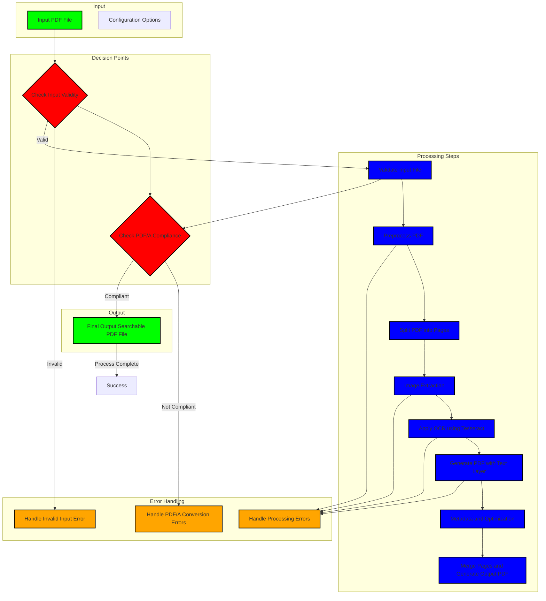
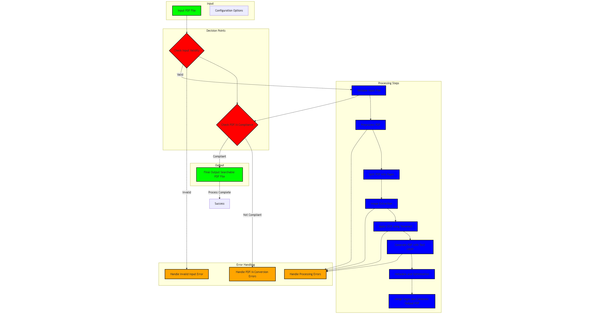

# 🧠 Mermaid Flowchart Generation Instruction

This template provides a ready-to-use instruction for GitHub Copilot (or ChatGPT) to generate a **detailed Mermaid flowchart** for an API. Specifically designed for codebases where an <<API_NAME>> API is implemented, this instruction guides Copilot to scan the logic and return a clean, styled visual flow.

---

## 📋 Instruction for GitHub Copilot or ChatGPT

Paste the following comment block directly above your OCR API implementation or in a relevant Markdown file:

```md

Generate a detailed Mermaid flowchart for the <<API_NAME>> API by scanning the code and identifying the key functional calls involved in the input processing and output generation.

🎯 Requirements:
- Use `flowchart TD` layout
- Clearly show the **input entry point** and **final output**
- Include intermediate function calls such as:
  - Pre-processing
  - Post-processing
  - Result formatting
- Highlight **error handling blocks** separately, if present
- Use different node styles or colors to distinguish:
  - Input/Output (green)
  - Processing steps (blue)
  - External services (gray)
  - Decision/Error nodes (red/orange)
- Keep edges clean and readable; avoid overlap
- Output must be valid Mermaid syntax only

```

## 📝 Viewing the File
To view the generated flowchart, ensure you have Mermaid support in your Markdown viewer or use a Mermaid live editor. The flowchart will visually represent the <<API_NAME>> API's logic, making it easier to understand the data flow and processing steps.

Copy the Mermaid code output by Copilot or ChatGPT and paste it into a Markdown file or a Mermaid live editor.

## 🌟 Example Output on OCRmyPDF Github Repo (https://github.com/ocrmypdf/OCRmyPDF)

### Input to Copilot or ChatGPT:

```md
Generate a detailed Mermaid flowchart for OCRmyPDF by scanning the code and identifying the key functional calls involved in the input processing and output generation.

🎯 Requirements:
- Use `flowchart TD` layout
- Clearly show the **input entry point** and **final output**
- Include intermediate function calls.
- Highlight **error handling blocks** separately, if present
- Use different node styles or colors to distinguish:
  - Input/Output (green)
  - Processing steps (blue)
  - External services (gray)
  - Decision/Error nodes (red/orange)
- Keep edges clean and readable; avoid overlap
- Output must be valid Mermaid syntax only
```

### Output from Copilot or ChatGPT:


### Mermaid Flowchart:

